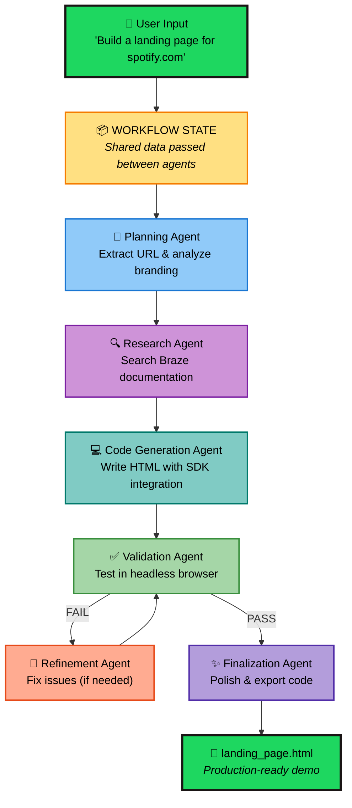
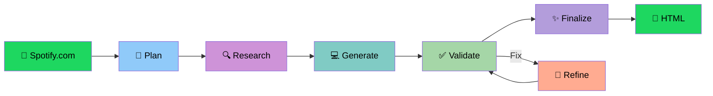
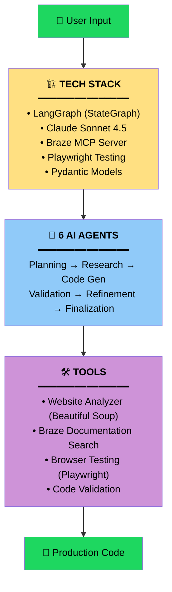

# Demo Workflow Diagram

## Simple Version (For Slides)

---

## Detailed Version (For Documentation)

```mermaid
flowchart TD
    Start["🎤 User Input<br/>'Build a landing page with user tracking for spotify.com'"]

    State["📦 WORKFLOW STATE<br/>━━━━━━━━━━━━━━━━━━━━<br/>Shared dictionary:<br/>• customer_website_url<br/>• branding_data<br/>• feature_plan<br/>• research_results<br/>• generated_code<br/>• validation_results"]

    P["🎯 <b>Planning Agent</b><br/>━━━━━━━━━━━━━━━━━━━━<br/>📥 Reads: messages<br/>━━━━━━━━━━━━━━━━━━━━<br/>1. Extract URL from message<br/>2. Analyze website (colors, fonts)<br/>3. Create feature plan<br/>━━━━━━━━━━━━━━━━━━━━<br/>📤 Updates: branding_data, feature_plan"]

    R["🔍 <b>Research Agent</b><br/>━━━━━━━━━━━━━━━━━━━━<br/>📥 Reads: feature_plan<br/>━━━━━━━━━━━━━━━━━━━━<br/>1. Generate search queries<br/>2. Search Braze docs (MCP)<br/>3. Get code examples<br/>4. Synthesize findings<br/>━━━━━━━━━━━━━━━━━━━━<br/>📤 Updates: research_results"]

    C["💻 <b>Code Generation Agent</b><br/>━━━━━━━━━━━━━━━━━━━━<br/>📥 Reads: feature_plan, branding_data, research_results<br/>━━━━━━━━━━━━━━━━━━━━<br/>1. Generate base template<br/>2. Apply customer branding<br/>3. Integrate SDK methods<br/>4. Create full HTML page<br/>━━━━━━━━━━━━━━━━━━━━<br/>📤 Updates: generated_code"]

    V["✅ <b>Validation Agent</b><br/>━━━━━━━━━━━━━━━━━━━━<br/>📥 Reads: generated_code<br/>━━━━━━━━━━━━━━━━━━━━<br/>1. Launch Playwright browser<br/>2. Load & test HTML<br/>3. Check SDK initialization<br/>4. Analyze errors<br/>━━━━━━━━━━━━━━━━━━━━<br/>📤 Updates: validation_results"]

    Ref["🔧 <b>Refinement Agent</b><br/>━━━━━━━━━━━━━━━━━━━━<br/>📥 Reads: generated_code, validation_results<br/>━━━━━━━━━━━━━━━━━━━━<br/>1. Read validation issues<br/>2. Apply targeted fixes<br/>3. Preserve working code<br/>━━━━━━━━━━━━━━━━━━━━<br/>📤 Updates: generated_code (fixed)<br/><i>(max 3 iterations)</i>"]

    F["✨ <b>Finalization Agent</b><br/>━━━━━━━━━━━━━━━━━━━━<br/>📥 Reads: generated_code, validation_results<br/>━━━━━━━━━━━━━━━━━━━━<br/>1. Add JSDoc comments<br/>2. Format & polish code<br/>3. Add metadata<br/>4. Export files<br/>━━━━━━━━━━━━━━━━━━━━<br/>📤 Exports: HTML + JSON metadata"]

    Output["📄 <b>Output</b><br/>━━━━━━━━━━━━━━━━━━━━<br/>✓ Spotify-branded landing page<br/>✓ Working Braze SDK integration<br/>✓ Browser-tested & validated<br/>✓ Production-ready code"]

    Start --> State
    State --> P
    P --> R
    R --> C
    C --> V
    V -->|❌ FAIL| Ref
    Ref -->|Loop back| V
    V -->|✅ PASS| F
    F --> Output

    style Start fill:#1ED760,stroke:#191414,stroke-width:4px,color:#000
    style State fill:#FFE082,stroke:#F57C00,stroke-width:3px,color:#000
    style P fill:#90CAF9,stroke:#1976D2,stroke-width:2px,color:#000
    style R fill:#CE93D8,stroke:#7B1FA2,stroke-width:2px,color:#000
    style C fill:#80CBC4,stroke:#00796B,stroke-width:2px,color:#000
    style V fill:#A5D6A7,stroke:#388E3C,stroke-width:2px,color:#000
    style Ref fill:#FFAB91,stroke:#E64A19,stroke-width:2px,color:#000
    style F fill:#B39DDB,stroke:#512DA8,stroke-width:2px,color:#000
    style Output fill:#1ED760,stroke:#191414,stroke-width:4px,color:#000
```

---

## One-Liner Version (For Quick Overview)

---

## Tech Stack Version (For Technical Audience)

---

## How to Use This in Your Demo

### Option 1: Render as PNG/SVG
Use one of these tools to convert Mermaid to image:
- **Mermaid Live Editor**: https://mermaid.live (paste, export as PNG/SVG)
- **VS Code Extension**: Mermaid Preview (right-click → Export)
- **CLI**: `mmdc -i diagram.md -o diagram.png`

### Option 2: Embed in Slides
- Copy the Mermaid code into Notion, GitPitch, or Marp
- These platforms render Mermaid automatically

### Option 3: GitHub/Markdown
- GitHub automatically renders Mermaid in markdown files
- Just paste this into your README or docs

### Recommendation for Demo
Use the **"Simple Version"** for your 3-5 minute demo - it's clean, easy to follow, and highlights the key flow without overwhelming detail.
