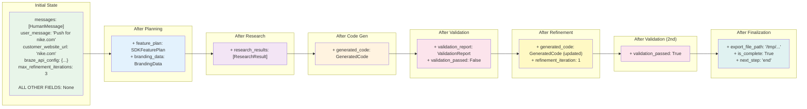
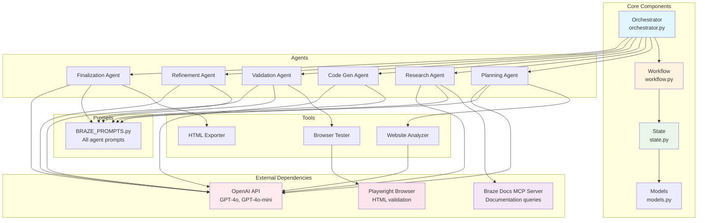

# Braze Code Generator - Complete Workflow Diagram

## =========High-Level Architecture ==========
graph TB
    subgraph "User Space"
        User[👤 User]
        UI[🖥️ Gradio UI Phase 4]
    end

    subgraph "Orchestrator Layer"
        Orch[🎯 Orchestrator orchestrator.py]
        Config[⚙️ Config BrazeAPIConfig]
        LLMs[🤖 LLMs GPT-4o, GPT-4o-mini]
        Tools[🔧 Tools WebsiteAnalyzer HTMLExporter BrowserTester]
    end

    subgraph "Workflow Execution Engine"
        WF[⚡ BrazeCodeGeneratorWorkflow workflow.py]
        Graph[📊 LangGraph StateGraph Compiled Graph]
    end

    subgraph "Agent Pipeline"
        %% We link these with hidden lines later to force a clean layout
        A1[📋 Planning Agent]
        A2[🔍 Research Agent]
        A3[💻 Code Gen Agent]
        A4[✅ Validation Agent]
        A5[🔧 Refinement Agent]
        A6[✨ Finalization Agent]
    end

    subgraph "State Management"
        State[📦 CodeGenerationState TypedDict]
    end

    %% -- Connections --
    
    %% 1. Configuration Flow
    User -->|1. Create & Configure| Orch
    Orch -.->|Reads| Config

    %% 2. Orchestration Start
    UI -->|2. Call generate_streaming| Orch
    Orch -->|3. Initialize| LLMs
    Orch -->|4. Initialize| Tools

    %% 3. Agent Initialization (Cleaned up)
    %% Instead of 6 arrows, we draw one to the group lead, and link the rest visually
    Orch -->|5. Create Agents| A1
    A1 -.- A2
    A2 -.- A3
    A3 -.- A4
    A4 -.- A5
    A5 -.- A6

    %% 4. Workflow Building
    Orch -->|6. Build Workflow| WF
    WF -->|7. Compile| Graph
    
    %% 5. Execution Flow
    Orch -->|8. Create Initial State| State
    Orch -->|9. Stream Execution| WF
    WF -->|10. Execute Pipeline| Graph
    Graph -->|11. Update State| State
    WF -->|12. Stream Updates| Orch
    Orch -->|13. Yield Progress| UI
    UI -->|14. Display Updates| User

    %% Styling
    style Orch fill:#e1f5ff,stroke:#01579b
    style WF fill:#fff3e0,stroke:#e65100
    style Graph fill:#f3e5f5,stroke:#4a148c
    style State fill:#e8f5e9,stroke:#1b5e20
    style Config fill:#eeeeee,stroke:#9e9e9e

---

## =======Detailed Orchestrator Initialization Flow========

sequenceDiagram
    autonumber
    
    box "Orchestration Layer" #f9f9f9
        participant User
        participant Orch as Orchestrator
    end

    box "Resources & Tools" #e1f5fe
        participant LLM as LangChain LLMs
        participant Tools as Shared Tools
        participant Agents as Agent System
    end

    box "Workflow Logic" #fff3e0
        participant WF as Workflow Engine
        participant Graph as LangGraph
    end

    User->>Orch: __init__(config, enable_browser_testing)
    activate Orch

    %% GROUP 1: LLM SETUP
    rect rgb(255, 250, 240)
        Note over Orch, LLM: Step 1: Initialize LLM Configurations
        Orch->>LLM: Initialize (GPT-4o, GPT-4o-mini)
        activate LLM
        LLM-->>Orch: Returns configured LLM instances
        deactivate LLM
    end

    %% GROUP 2: TOOLS SETUP
    rect rgb(240, 255, 240)
        Note over Orch, Tools: Step 2: Initialize Shared Tools
        Orch->>Tools: Create WebsiteAnalyzer, HTMLExporter, BrowserTester
        activate Tools
        Tools-->>Orch: Returns tool instances
        deactivate Tools
    end

    %% GROUP 3: AGENT CREATION
    rect rgb(240, 240, 255)
        Note over Orch, Agents: Step 3: Instantiate Agents
        Orch->>Agents: _initialize_agents()
        activate Agents
        
        Note right of Agents: Creates 6 specialized agents (Planning, Research, CodeGen, Validation, Refinement, Finalization)
        
        Agents-->>Orch: Returns list of 6 Agents
        deactivate Agents
    end

    %% GROUP 4: WORKFLOW BUILDING
    rect rgb(255, 245, 245)
        Note over Orch, Graph: Step 4: Compile State Graph
        Orch->>WF: create_workflow(agents)
        activate WF
        
        WF->>WF: _build_graph()
        WF->>Graph: Instantiate StateGraph(CodeGenerationState)
        activate Graph
        
        Note right of Graph: 1. Add Nodes (Planning->Finalization) 2. Add Edges (Linear Flow) 3. Add Conditional Edges (Router)
        
        WF->>Graph: graph.compile()
        Graph-->>WF: Returns Compiled Runnable
        deactivate Graph
        
        WF-->>Orch: Returns executable workflow
        deactivate WF
    end

    Orch-->>User: Returns Orchestrator Instance
    deactivate Orch

---

## Complete Streaming Execution Flow

```mermaid
sequenceDiagram
    participant User
    participant UI as Gradio UI
    participant Orch as Orchestrator
    participant WF as Workflow
    participant Graph as StateGraph
    participant State as CodeGenerationState
    participant PA as Planning Agent
    participant RA as Research Agent
    participant CG as Code Gen Agent
    participant VA as Validation Agent
    participant RF as Refinement Agent
    participant FA as Finalization Agent

    User->>UI: Enter message: "Push notifications for nike.com"
    UI->>Orch: set_braze_api_config(config)
    Orch-->>UI: ✓ Config set

    UI->>Orch: generate_streaming(message, website_url)

    Note over Orch: Validate config exists
    alt Config missing
        Orch-->>UI: yield {"type": "error", "message": "No config"}
    end

    Note over Orch: Create initial state
    Orch->>State: create_initial_state(message, config, url, max_iterations=3)
    State-->>Orch: state = {<br/>  "messages": [HumanMessage(...)],<br/>  "user_message": "...",<br/>  "customer_website_url": "nike.com",<br/>  "braze_api_config": config,<br/>  "max_refinement_iterations": 3,<br/>  ...all other fields None<br/>}

    Note over Orch: Start streaming
    Orch->>WF: stream_workflow(state)
    WF->>Graph: self.graph.stream(state)

    Note over Graph: Node 1: Planning
    Graph->>WF: _planning_node(state)
    WF->>PA: planning_agent.process(state)

    Note over PA: Extract URL → Analyze website → Create plan
    PA->>PA: Extract "nike.com" from message
    PA->>PA: website_analyzer.analyze_website("nike.com")
    PA->>PA: Create SDKFeaturePlan with branding

    PA-->>WF: return {<br/>  "feature_plan": SDKFeaturePlan(...),<br/>  "branding_data": BrandingData(colors=..., fonts=...),<br/>  "customer_website_url": "nike.com"<br/>}

    Graph->>State: Merge updates into state
    State-->>Graph: state now has feature_plan, branding_data

    WF->>WF: _format_node_status("planning", output)
    WF-->>Orch: yield {<br/>  "type": "node_complete",<br/>  "node": "planning",<br/>  "status": "✓ Feature plan created with customer branding"<br/>}
    Orch-->>UI: yield update
    UI-->>User: Display: "✓ Feature plan created"

    Note over Graph: Node 2: Research
    Graph->>WF: _research_node(state)
    WF->>RA: research_agent.process(state)

    Note over RA: Read feature_plan → Query Braze Docs MCP
    RA->>RA: Read state["feature_plan"]
    RA->>RA: Query MCP for "push notifications"
    RA->>RA: Query MCP for "user tracking"

    RA-->>WF: return {<br/>  "research_results": [<br/>    ResearchResult(query="push", docs="..."),<br/>    ResearchResult(query="tracking", docs="...")<br/>  ]<br/>}

    Graph->>State: Merge updates
    State-->>Graph: state has feature_plan, branding_data, research_results

    WF-->>Orch: yield {<br/>  "type": "node_complete",<br/>  "node": "research",<br/>  "status": "✓ Braze documentation research complete"<br/>}
    Orch-->>UI: yield update
    UI-->>User: Display: "✓ Research complete"

    Note over Graph: Node 3: Code Generation
    Graph->>WF: _code_generation_node(state)
    WF->>CG: code_generation_agent.process(state)

    Note over CG: Read context → Generate branded HTML
    CG->>CG: Read feature_plan, research_results, branding_data
    CG->>CG: Generate HTML with Nike colors/fonts
    CG->>CG: Include Braze SDK initialization

    CG-->>WF: return {<br/>  "generated_code": GeneratedCode(<br/>    html="<!DOCTYPE html>...",<br/>    braze_sdk_initialized=True,<br/>    features_implemented=["push", "tracking"]<br/>  )<br/>}

    Graph->>State: Merge updates
    State-->>Graph: state has generated_code

    WF-->>Orch: yield {<br/>  "type": "node_complete",<br/>  "node": "code_generation",<br/>  "status": "✓ Landing page code generated"<br/>}
    Orch-->>UI: yield update
    UI-->>User: Display: "✓ Code generated"

    Note over Graph: Node 4: Validation
    Graph->>WF: _validation_node(state)
    WF->>VA: validation_agent.process(state)

    Note over VA: Run Playwright browser test
    VA->>VA: Read state["generated_code"].html
    VA->>VA: browser_tester.validate_html(html)
    VA->>VA: Check Braze SDK loaded
    VA->>VA: Check console errors

    VA-->>WF: return {<br/>  "validation_report": ValidationReport(<br/>    passed=False,<br/>    issues=[ValidationIssue(...)],<br/>    braze_sdk_loaded=True<br/>  ),<br/>  "validation_passed": False,<br/>  "next_step": "refine"<br/>}

    Graph->>State: Merge updates
    State-->>Graph: state has validation_report, validation_passed=False

    WF-->>Orch: yield {<br/>  "type": "node_complete",<br/>  "node": "validation",<br/>  "status": "⚠ Validation issues detected, starting refinement"<br/>}
    Orch-->>UI: yield update
    UI-->>User: Display: "⚠ Validation issues"

    Note over Graph: Router: After Validation
    Graph->>WF: _route_after_validation(state)
    WF->>WF: validation_passed = state.get("validation_passed") = False
    WF->>WF: current_iteration = state.get("refinement_iteration") = 0
    WF->>WF: max_iterations = 3
    WF->>WF: if validation_passed: return "finalize"
    WF->>WF: elif current_iteration >= max_iterations: return "finalize"
    WF->>WF: else: return "refine"
    WF-->>Graph: return "refine"

    Note over Graph: Node 5: Refinement (Iteration 1)
    Graph->>WF: _refinement_node(state)
    WF->>RF: refinement_agent.process(state)

    Note over RF: Fix validation issues
    RF->>RF: Read validation_report.issues
    RF->>RF: Read generated_code.html
    RF->>RF: Fix issues in HTML

    RF-->>WF: return {<br/>  "generated_code": GeneratedCode(html="FIXED HTML"),<br/>  "refinement_iteration": 1<br/>}

    Graph->>State: Merge updates
    State-->>Graph: state has updated generated_code, refinement_iteration=1

    WF-->>Orch: yield {<br/>  "type": "node_complete",<br/>  "node": "refinement",<br/>  "status": "✓ Code refined (iteration 1)"<br/>}
    Orch-->>UI: yield update
    UI-->>User: Display: "✓ Code refined (1/3)"

    Note over Graph: Loop back to Validation
    Graph->>WF: _validation_node(state)
    WF->>VA: validation_agent.process(state)
    VA->>VA: Test fixed HTML
    VA-->>WF: return {<br/>  "validation_passed": True,<br/>  "next_step": "finalize"<br/>}

    Graph->>State: Merge updates
    State-->>Graph: state has validation_passed=True

    WF-->>Orch: yield {<br/>  "type": "node_complete",<br/>  "node": "validation",<br/>  "status": "✓ Browser validation complete"<br/>}
    Orch-->>UI: yield update
    UI-->>User: Display: "✓ Validation passed"

    Note over Graph: Router: After Validation (2nd time)
    Graph->>WF: _route_after_validation(state)
    WF->>WF: validation_passed = True
    WF-->>Graph: return "finalize"

    Note over Graph: Node 6: Finalization
    Graph->>WF: _finalization_node(state)
    WF->>FA: finalization_agent.process(state)

    Note over FA: Polish → Export
    FA->>FA: Polish HTML
    FA->>FA: html_exporter.export_landing_page(html, branding, plan)
    FA->>FA: Generate success message

    FA-->>WF: return {<br/>  "export_file_path": "/tmp/braze_exports/nike_20260107.html",<br/>  "is_complete": True,<br/>  "next_step": "end",<br/>  "messages": [AIMessage("✅ Success!...")]<br/>}

    Graph->>State: Merge updates (final)
    State-->>Graph: state is complete

    WF-->>Orch: yield {<br/>  "type": "node_complete",<br/>  "node": "finalization",<br/>  "status": "✓ Landing page finalized and exported"<br/>}
    Orch-->>UI: yield update

    WF-->>Orch: yield {<br/>  "type": "message",<br/>  "content": "✅ Landing page generated successfully!..."<br/>}
    Orch-->>UI: yield update

    Note over Graph: Workflow complete
    Graph-->>WF: stream complete
    WF-->>Orch: generator exhausted
    Orch-->>UI: generator exhausted
    UI-->>User: Display final message + download button
```

---

## StateGraph Node Flow with Conditional Routing

```mermaid
flowchart TD
    Start([START]) --> Planning

    subgraph Planning["🎯 Planning Node"]
        P1[Read user_message]
        P2[Extract website URL]
        P3[Analyze website<br/>WebsiteAnalyzer]
        P4[Create SDKFeaturePlan<br/>with branding]
        P1 --> P2 --> P3 --> P4
    end

    Planning --> Research

    subgraph Research["🔍 Research Node"]
        R1[Read feature_plan]
        R2[Query Braze Docs MCP<br/>for each feature]
        R3[Collect documentation]
        R1 --> R2 --> R3
    end

    Research --> CodeGen

    subgraph CodeGen["💻 Code Generation Node"]
        C1[Read feature_plan<br/>research_results<br/>branding_data]
        C2[Generate HTML<br/>with customer branding]
        C3[Include Braze SDK init]
        C1 --> C2 --> C3
    end

    CodeGen --> Validation1

    subgraph Validation1["✅ Validation Node"]
        V1[Read generated_code]
        V2[Run Playwright test<br/>BrowserTester]
        V3[Check SDK loaded]
        V4[Check console errors]
        V5[Create ValidationReport]
        V1 --> V2 --> V3 --> V4 --> V5
    end

    Validation1 --> Router1{Router:<br/>Validation Passed?}

    Router1 -->|Yes| Finalization
    Router1 -->|No + iteration < 3| Refinement
    Router1 -->|No + iteration >= 3| Finalization

    subgraph Refinement["🔧 Refinement Node"]
        RF1[Read validation_report]
        RF2[Analyze issues]
        RF3[Fix HTML]
        RF4[Increment iteration]
        RF1 --> RF2 --> RF3 --> RF4
    end

    Refinement --> Validation2["✅ Validation Node<br/>(2nd pass)"]
    Validation2 --> Router2{Router:<br/>Validation Passed?}
    Router2 -->|Yes| Finalization
    Router2 -->|No + iteration < 3| Refinement
    Router2 -->|No + iteration >= 3| Finalization

    subgraph Finalization["✨ Finalization Node"]
        F1[Polish HTML]
        F2[Export to file<br/>HTMLExporter]
        F3[Generate metadata]
        F4[Create success message]
        F1 --> F2 --> F3 --> F4
    end

    Finalization --> End([END])

    style Start fill:#e8f5e9
    style End fill:#ffebee
    style Planning fill:#e3f2fd
    style Research fill:#f3e5f5
    style CodeGen fill:#fff3e0
    style Validation1 fill:#fce4ec
    style Validation2 fill:#fce4ec
    style Refinement fill:#fff9c4
    style Finalization fill:#e0f2f1
    style Router1 fill:#ffccbc
    style Router2 fill:#ffccbc
```

---

## State Evolution Through Pipeline

---

## Key Components Data Flow

---

## Summary

This comprehensive diagram set shows:

1. **High-Level Architecture**: How all components fit together
2. **Initialization Flow**: Step-by-step orchestrator setup
3. **Streaming Execution**: Complete message flow with all agents
4. **StateGraph Flow**: Conditional routing and node transitions
5. **State Evolution**: How state accumulates data through pipeline
6. **Data Flow**: Dependencies between all components

The key insight: **Orchestrator is the coordinator, Workflow is the executor, and State is the shared memory that flows through the pipeline.**
