# Braze Code Generator - Complete Workflow Diagram

## High-Level Architecture

```mermaid
graph TB
    subgraph "User Space"
        User[👤 User]
        UI[🖥️ Gradio UI<br/>Phase 4]
    end

    subgraph "Orchestrator Layer"
        Orch[🎯 Orchestrator<br/>orchestrator.py]
        Config[⚙️ Config<br/>BrazeAPIConfig]
        LLMs[🤖 LLMs<br/>GPT-4o, GPT-4o-mini]
        Tools[🔧 Tools<br/>WebsiteAnalyzer<br/>HTMLExporter<br/>BrowserTester]
    end

    subgraph "Workflow Execution Engine"
        WF[⚡ BrazeCodeGeneratorWorkflow<br/>workflow.py]
        Graph[📊 LangGraph StateGraph<br/>Compiled Graph]
    end

    subgraph "Agent Pipeline"
        A1[📋 Planning Agent]
        A2[🔍 Research Agent]
        A3[💻 Code Gen Agent]
        A4[✅ Validation Agent]
        A5[🔧 Refinement Agent]
        A6[✨ Finalization Agent]
    end

    subgraph "State Management"
        State[📦 CodeGenerationState<br/>TypedDict]
    end

    User -->|1. Create & Configure| Orch
    Orch -.->|Reads| Config

    UI -->|2. Call generate_streaming| Orch
    Orch -->|3. Initialize| LLMs
    Orch -->|4. Initialize| Tools

    Orch -->|5. Create Agents| A1
    A1 -.- A2
    A2 -.- A3
    A3 -.- A4
    A4 -.- A5
    A5 -.- A6

    Orch -->|6. Build Workflow| WF
    WF -->|7. Compile| Graph

    Orch -->|8. Create Initial State| State
    Orch -->|9. Stream Execution| WF
    WF -->|10. Execute Pipeline| Graph
    Graph -->|11. Update State| State
    WF -->|12. Stream Updates| Orch
    Orch -->|13. Yield Progress| UI
    UI -->|14. Display Updates| User

    style Orch fill:#e1f5ff,stroke:#01579b
    style WF fill:#fff3e0,stroke:#e65100
    style Graph fill:#f3e5f5,stroke:#4a148c
    style State fill:#e8f5e9,stroke:#1b5e20
    style Config fill:#eeeeee,stroke:#9e9e9e
```

---

## Detailed Orchestrator Initialization Flow

---

## Complete Streaming Execution Flow

---

## StateGraph Node Flow with Conditional Routing

```mermaid
flowchart TD
    Start([START]) --> P1

    subgraph Planning["🎯 Planning Node"]
        direction TB
        P1[Read User Message] --> P2[Extract Website URL]
        P2 --> P3["Analyze Website<br/>(WebsiteAnalyzer)"]
        P3 --> P4["Create Feature Plan<br/>& Branding"]
    end

    P4 --> R1

    subgraph Research["🔍 Research Node"]
        direction TB
        R1[Read Feature Plan] --> R2[Query Braze Docs MCP]
        R2 --> R3[Collect Documentation]
    end

    R3 --> C1

    subgraph CodeGen["💻 Code Generation Node"]
        direction TB
        C1["Read Context<br/>(Plan, Docs, Brand)"] --> C2[Generate HTML]
        C2 --> C3[Inject Braze SDK]
    end

    C3 --> V1

    subgraph Validation["✅ Validation Node"]
        direction TB
        V1[Read Generated Code] --> V2[Run Playwright Test]
        V2 --> V3[Check SDK & Console]
        V3 --> V4[Create ValidationReport]
    end

    V4 --> Router{Router:<br/>Passed?}

    Router -->|Yes| F1
    Router -->|"No (Max Retries)"| F1
    Router -->|"No (Retries Left)"| RF1

    subgraph Refinement["🔧 Refinement Node"]
        direction TB
        RF1[Read Report Issues] --> RF2[Fix HTML Code]
        RF2 --> RF3[Increment Iteration]
    end

    RF3 -.->|Loop| V1

    subgraph Finalization["✨ Finalization Node"]
        direction TB
        F1[Polish HTML] --> F2[Export to File]
        F2 --> F3[Generate Success Msg]
    end

    F3 --> End([END])

    style Start fill:#4caf50,stroke:#2e7d32,color:white
    style End fill:#f44336,stroke:#c62828,color:white
    style Router fill:#ff9800,stroke:#ef6c00,color:white

    style Planning fill:#e3f2fd,stroke:#1565c0
    style Research fill:#f3e5f5,stroke:#7b1fa2
    style CodeGen fill:#fff3e0,stroke:#e65100
    style Validation fill:#ffebee,stroke:#c62828
    style Refinement fill:#fffde7,stroke:#fbc02d
    style Finalization fill:#e0f2f1,stroke:#00695c
```

---

## State Evolution Through Pipeline

```mermaid
flowchart TD
    Start([🚀 Start State Trace]) --> S0

    S0["<b>📍 Initial Context</b><br/><i>New Fields:</i><br/>• user_message: 'Push for nike.com'<br/>• url: 'nike.com'<br/>• max_iterations: 3"]

    S0 --> S1
    S1["<b>🎯 After Planning</b><br/><i>New Fields:</i><br/>• feature_plan: SDKFeaturePlan<br/>• branding_data: BrandingData"]

    S1 --> S2
    S2["<b>🔍 After Research</b><br/><i>New Fields:</i><br/>• research_results: ResearchResult..."]

    S2 --> S3
    S3["<b>💻 After Code Gen</b><br/><i>New Fields:</i><br/>• generated_code: GeneratedCode"]

    subgraph LoopTrace["🔁 Refinement Loop Trace (Iteration 1)"]
        direction TB

        S3 --> S4
        S4["<b>❌ After Validation (Fail)</b><br/><i>New Fields:</i><br/>• validation_passed: False<br/>• validation_report: Issues Found"]

        S4 --> S5
        S5["<b>🔧 After Refinement</b><br/><i>Updates:</i><br/>• generated_code: Updated HTML<br/>• refinement_iteration: 1"]

        S5 --> S6
        S6["<b>✅ After Validation (Pass)</b><br/><i>Updates:</i><br/>• validation_passed: True"]
    end

    S6 --> S7
    S7["<b>✨ After Finalization</b><br/><i>New Fields:</i><br/>• export_file_path: /tmp/...<br/>• is_complete: True"]

    S7 --> End([🏁 End of Trace])

    classDef base fill:#fff,stroke:#666,stroke-width:1px
    classDef context fill:#e3f2fd,stroke:#1565c0,stroke-width:2px
    classDef fail fill:#ffebee,stroke:#c62828,stroke-width:2px
    classDef success fill:#e8f5e9,stroke:#2e7d32,stroke-width:2px

    class S0,S1,S2,S3,S5 base
    class S4 fail
    class S6,S7 success
    class Start,End context
```

---

## Key Components Data Flow

---

## Summary

This comprehensive diagram set shows:

1. **High-Level Architecture**: How all components fit together
2. **Initialization Flow**: Step-by-step orchestrator setup
3. **Streaming Execution**: Complete message flow with all agents
4. **StateGraph Flow**: Conditional routing and node transitions
5. **State Evolution**: How state accumulates data through pipeline
6. **Data Flow**: Dependencies between all components

The key insight: **Orchestrator is the coordinator, Workflow is the executor, and State is the shared memory that flows through the pipeline.**
