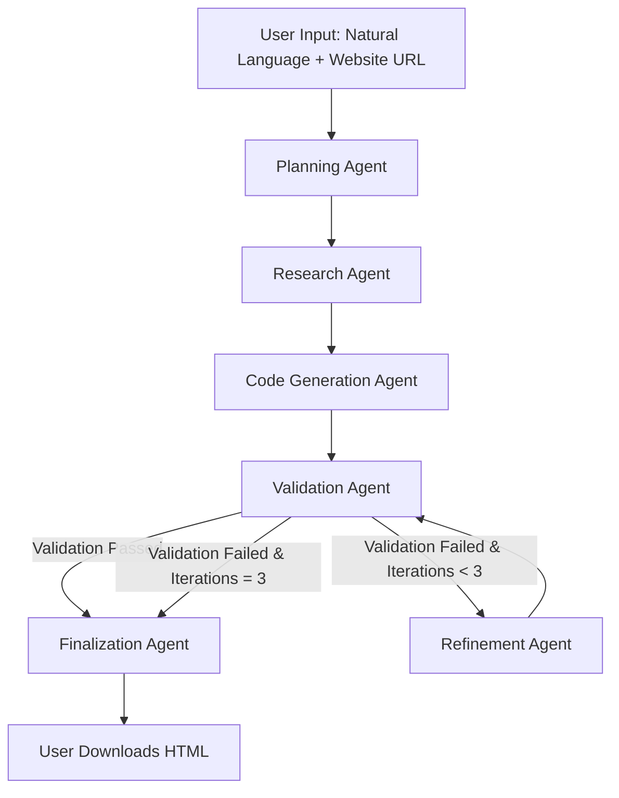
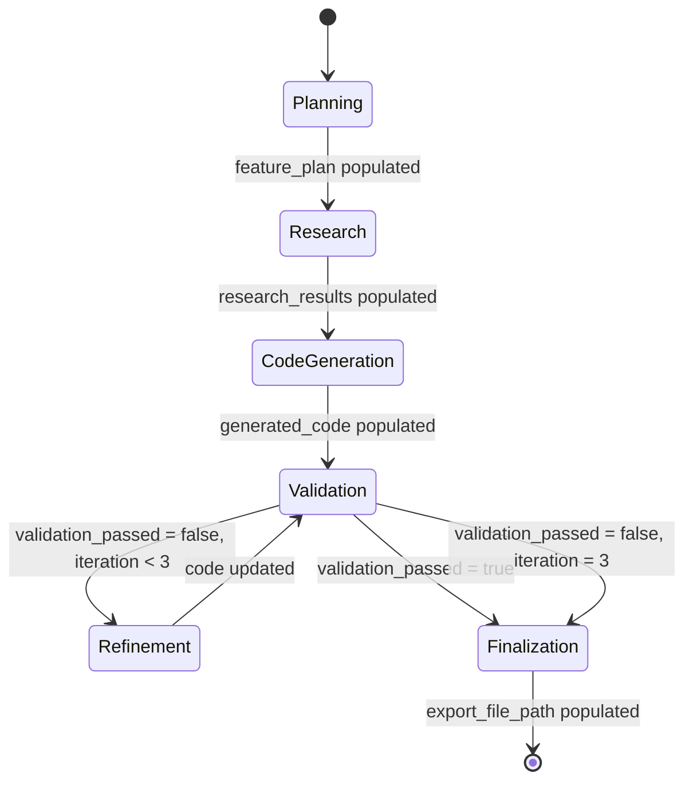

# Braze SDK Landing Page Generator

**Estimated reading time**: 15-20 minutes

---

## Overview

An AI-powered code generation system that automatically creates fully functional, branded HTML landing pages with Braze SDK integrations from natural language descriptions.

The tool transforms plain English requests like "Create a landing page with push notifications for Nike" into production-ready HTML pages in 2-3 minutes. It eliminates the need for TAMs invest resources into building SDK demo pages, while ensuring quality through automated browser validation.

### Key Capabilities

- **Zero coding required** - Natural language input only. Describe what you want, and the system generates the complete HTML page
- **Automatic brand extraction** - Analyzes customer websites to extract colors, fonts, and visual identity for personalized demos
- **Browser validation with Playwright** - Every generated page is tested in a headless browser to catch JavaScript errors before delivery
- **Multi-agent pipeline with automatic refinement** - If validation fails, the system automatically fixes errors (up to 3 iterations)
- **Multi-provider LLM support** - Works with OpenAI, Anthropic, or Google Gemini for future proofed flexibility
- **Real-time progress streaming** - Watch the AI work through planning, research, code generation, validation, and finalization in real-time

### Time Savings

Reduces demo page creation from hours to minutes:
- **Before**: TAM configures IDE enviornment → manually write 100-1000 lines of code → manually test → iterate 
- **After**: Describe what you need → 2-3 minutes → download branded, validated page → share with customer

---

## Business Value Justification

### Current State (Pre-Tool)

**The Manual Process**:
- TAMs need to create custom SDK demo for customer presentations
- Generic templates don't match customer branding, reducing impact
- Manual coding leads to SDK implementation errors
- Engineering time is diverted from strategic account work to repetitive demo creation

**Pain Points**:
- Time to value extended by demo delays
- Low iteration velocity - high cost of changes means demos rarely get refined
- Knowledge silos - different TAMs have varying degrees of coding skills and Braze SDK knowledge
- Quality inconsistencies - manual implementations vary in quality and best practices adherence

---

### Future State (Post-Tool Rollout)

**The AI-Powered Process**:
- **Self-service**: TAMs generate pages independently without coding time commitment
- **Instant turnaround**: Pages generated in 2-3 minutes
- **Customer-branded**: Automatic extraction of customer colors/fonts creates personalized demos that resonate
- **Quality-assured**: Every page validated in a real browser - JavaScript errors caught before delivery
- **Unlimited scalability**: Generate as many demo pages as needed without resource constraints

---

### Negative Consequences (Pain Points Addressed)

| Pain Point | Impact | How Tool Solves It |
|------------|--------|-------------------|
| **Lost sales velocity** | Delays in demo availability extend sales cycles, reducing close rates | Demos available same-day for customer meetings |
| **Poor customer experience** | Generic demos fail to resonate with customer brand identity | Automatic brand extraction creates personalized demos |
| **Engineering overhead** | Context-switching between product work and demo requests reduces productivity | Self-service eliminates engineering dependency |
| **Inconsistent quality** | Manual SDK implementations prone to errors, creating bad first impressions | Browser validation ensures every page works correctly |
| **Lack of iteration** | High cost of changes ($150-300 per revision) means demos rarely get refined | Near-zero cost of regeneration enables fast iteration |

---

### Positive Outcomes (What This Tool Solves)

**Measurable Impact**:
- **Accelerated TAM output**: Demos available in minutes instead of hours
- **Increased value propositons**: Branded demos create stronger emotional connection with customers
- **TAM empowerment**: Self-sufficiency increases confidence and responsiveness to customer needs
- **Quality consistency**: Every page validated against Braze SDK best practices

**Strategic Benefits**:
- TAMs can iterate rapidly based on customer feedback during meetings
- TAMs can focus on high-value client work instead of repetitive demo creation
- Knowledge democratization - best practices baked into AI system instead of siloed in individual TAMs
- Scalability - tool usage grows without linear increase in TAM resources

---

## Assets

### Quick Start Guide

#### Prerequisites

- **Python 3.11+** (check with `python3 --version`)
- **Braze API key and SDK endpoint** (get from your Braze dashboard)
- **LLM provider API key** (OpenAI, Anthropic, or Google - OpenAI recommended for balance of cost/quality)

#### Installation Steps (5-Minute Setup)

```bash
# 1. Clone the repository
git clone [INSERT_YOUR_GITHUB_URL]
cd code-gen-agent/code

# 2. Create virtual environment
python3 -m venv .venv
source .venv/bin/activate

# 3. Install dependencies
pip install -r requirements.txt

# 4. Configure environment
cp ../.env.example ../.env

# Edit .env with your API keys:
# - MODEL_PROVIDER=openai (or anthropic, google)
# - OPENAI_API_KEY=sk-...
# - BRAZE_API_KEY=...
# - BRAZE_SDK_ENDPOINT=... (e.g., sondheim.braze.com)

# 5. Launch UI
python -m braze_code_gen
# Opens at http://localhost:7860
```

#### Using the UI

**Step 1: Configure Braze API Settings** (one-time setup)
1. Open http://localhost:7860 in your browser
2. In Section 1 (Braze API Configuration):
   - Enter your Braze API key
   - Enter SDK endpoint (e.g., `sondheim.braze.com`)
   - Click "Validate Configuration"
   - Wait for green confirmation message

**Step 2: Generate Landing Page**
1. In Section 2 (Generate Landing Page):
   - **Describe desired features** in plain English (see example prompts below)
   - **Provide customer website URL** for automatic branding (e.g., `https://nike.com`)
   - Click "Generate Landing Page"
   - Watch real-time progress updates as the AI works through:
     - Planning → Research → Code Generation → Validation → Refinement → Finalization

**Step 3: Review & Download**
1. In Section 3 (Preview & Download):
   - Review generated page in live HTML preview
   - Click "Download HTML" button
   - Share with customer or deploy to hosting

#### Example Prompts

**Simple push notification page**:
```
Create a landing page with email subscription for https://nike.com
```

**Multi-feature demo**:
```
Build a page showing content cards, in-app messages, and custom event tracking for https://spotify.com
```

**Email capture with user attributes**:
```
Make a simple page with email capture form and user attribute updates (first name, last name, email) for https://airbnb.com
```

**Advanced integrations**:
```
Create a landing page with push notification subscription, in-app message display, and event tracking for "add_to_cart" and "purchase" events for https://sephora.com
```

---

### GitHub Repository Links

- **Primary Repository**: [INSERT_YOUR_GITHUB_URL]
- **Documentation**: [INSERT_YOUR_GITHUB_URL/tree/main/docs]
- **Issues/Support**: [INSERT_YOUR_GITHUB_URL/issues]

---

### Known Limitations**:
  - Maximum 3 refinement iterations per generation (prevents infinite loops)
  - Requires customer website to be publicly accessible for branding extraction
  - Generated pages are client-side only (no backend functionality)
  - Best results with well-known brands that have clear design systems

---

## Learning Process

This project was built over 4+ months, from initial research to production-ready system. Below is a high-level timeline of the journey.

### Phase 1: Educational Foundation

**Research & Learning**:
- Studied **LangChain** (LLM orchestration framework) and **LangGraph** (workflow state machines)in AI produc design course delivered by Maven
- Explored multi-agent architectures and when to use them vs. single-agent systems
- Experimented with different LLM providers (OpenAI, Anthropic, Google) to understand cost/performance tradeoffs

**Key Insight**: Different tasks require different LLM tiers. Not all agents need expensive models. For example:
- Code generation requires premium models (GPT-4o, Claude Opus) for deep reasoning
- Documentation search works fine with budget models (GPT-4o-mini, Gemini Flash)
- This insight reduced cost per run from **$1.50 to $0.10** for Gemini-based workflows

---

### Phase 2: Architecture & Planning 

**Major Decision**: Chose **LangGraph StateGraph** over separate microservices for workflow orchestration.

**Rationale**:
- Needed **conditional routing** (e.g., "if validation fails, go to refinement; otherwise, go to finalization")
- Needed **iterative refinement** (loop back to validation up to 3 times)
- StateGraph provides built-in state management, eliminating manual state passing between agents

**Trade-off Considered**:
- **Separate agents (microservices)**: More flexibility, but lost context between agents and required manual state coordination
- **Monolithic workflow (StateGraph)**: Less flexibility, but elegant state management and built-in routing

**Chose StateGraph** because state management simplicity outweighed the flexibility loss.

**Key Design**: 6-agent pipeline:
1. **Planning Agent** → Extracts website URL, analyzes branding, creates feature plan
2. **Research Agent** → Queries Braze docs for SDK implementation guidance
3. **Code Generation Agent** → Generates HTML/CSS/JavaScript with Braze SDK integration
4. **Validation Agent** → Tests in Playwright browser, checks for errors
5. **Refinement Agent** → Fixes errors if validation fails (up to 3 iterations)
6. **Finalization Agent** → Polishes code and exports HTML file

---

### Phase 3: Core Implementation

**Built Foundation**:
- **LLM Factory Pattern** - Abstraction layer for switching between OpenAI, Anthropic, and Google providers
- **TypedDict-based state management** - Type-safe state object that accumulates data across all agents
- **Braze Docs MCP Server (product beta wrapped in LangChain tool decorator)** - Cached 50+ Braze documentation pages for instant access (no API calls)

**Built Agents**: Implemented all 6 specialized agents with distinct responsibilities (see Phase 2 for list)

**Built Tools**:
- **Website Analyzer** - BeautifulSoup + cssutils for extracting brand colors and fonts from customer websites
- **Browser Testing Harness** - Playwright headless browser for validating generated pages
- **Export System** - HTML file export with JSON metadata sidecar

---

### Phase 4: Quality & Validation

**Challenge**: Early versions generated syntactically correct but **runtime-broken code** (~40% failure rate).

**Example**: Code would initialize Braze SDK correctly but reference undefined variables or use outdated SDK methods.

**Solution**: Integrated **Playwright browser testing** to catch JavaScript errors at runtime:
- Error rate dropped from **40% to 5%** with browser validation
- Error rate dropped further to **<2%** with refinement loop (automatic error fixing)

**Innovation**: Added **refinement loop with max 3 iterations**:
- If validation fails, send errors to Refinement Agent
- Refinement Agent analyzes console errors and applies targeted fixes including validated SDK methods
- Loop back to Validation Agent
- Repeat up to 3 times, then force completion

---

### Phase 4: Documentation & deployment

**Created 8 comprehensive docs**:
- Architecture diagrams (mermaid)
- Workflow orchestration patterns
- Implementation plan
- Agent design patterns
- Factory pattern for LLM abstraction
- Tool integration guide
- UI patterns
- Troubleshooting guide

**Deployment**: Simplified to single-command launch (`python -m braze_code_gen`)

---

### Key Decisions & Rationale

| Decision | Alternatives Considered | Why This Choice |
|----------|------------------------|-----------------|
| **LangGraph StateGraph** | Separate microservices, Chain-of-thought prompting | Needed conditional routing and state accumulation across agents |
| **Multi-provider LLM support** | Lock into single provider | Future proof against vendor change |
| **Browser testing (Playwright)** | Static analysis only | Only way to catch runtime JavaScript errors |
| **Cached MCP documentation** | Real-time API calls to Braze docs | Instant access, no API rate limits, consistent results |
| **TypedDict for state** | Pydantic models | Simpler, LangGraph's recommended pattern |
| **Refinement loop (max 3)** | Single-shot generation | AI models need iteration for quality (95% fix rate on retry) |

---

## Key Learnings

### A. Multi-Agent Architecture Patterns

#### What Worked

**1. Specialized Agents**:
- Each agent has a **single responsibility** (planning vs. coding vs. validation)
- Prevents bloated prompts and improves reliability
- Example: Planning Agent only extracts requirements and website URL - doesn't try to code

**2. State Accumulation**:
- **TypedDict pattern** keeps all agents in sync via shared state object
- No manual state passing between agents - LangGraph handles it automatically
- Example state structure:

```python
class CodeGenerationState(TypedDict):
    messages: Annotated[Sequence[BaseMessage], add_messages]  # Conversation history
    feature_plan: Optional[SDKFeaturePlan]      # From Planning Agent
    research_results: Optional[ResearchResult]  # From Research Agent
    generated_code: Optional[GeneratedCode]     # From Code Gen Agent
    validation_passed: bool                      # From Validation Agent
    refinement_iteration: int                    # Tracks loop count
```

**3. Conditional Routing**:
- LangGraph's `add_conditional_edges` enables intelligent workflow branching
- Example: If validation passes → go to finalization; if fails and iterations < 3 → go to refinement; if fails and iterations = 3 → force completion

**4. Message History**:
- Annotated `Sequence[BaseMessage]` preserves conversation context across agents
- Later agents can reference earlier decisions (e.g., Refinement Agent sees original user request)

#### What Didn't Work

**1. Initial Approach (Separate Chains)**:
- Lost context between agents
- Required manual state passing via dictionaries
- Hard to debug - state spread across multiple objects

**2. No Validation Step**:
- Early versions generated broken code **~40% of the time**
- Discovered through user testing - syntactically correct but runtime-broken JavaScript

**3. Single-Tier LLM**:
- Single model support creates vendor lock in to Google Gemini
-Adding multi model support increases flexibilty and future proofs this tool

#### Architecture Insight

**The refinement loop is critical**. AI models rarely generate perfect code on first try - planning for iteration is essential.

**Data**:
- First-pass success rate: **60%**
- Refinement success rate (fixing errors): **95%**
- Final success rate after up to 3 iterations: **>98%**

---

### B. AI Reliability and Validation

#### The Problem

LLMs generate **plausible-looking but often broken code**. They understand syntax but struggle with runtime semantics.

**Example Failures** (before browser testing):
- Undefined variables referenced in event handlers
- Outdated/incorrect Braze SDK methods (e.g., `appboy` namespace instead of `braze` / `braze.setUserId()` instead of `braze.changeUser()`)
- Type errors (passing string where object expected)

#### Real Data

| Validation Strategy | Error Rate | Notes |
|---------------------|-----------|-------|
| **No validation** | ~40% | Syntactically correct but runtime-broken |
| **Playwright browser testing** | ~5% | Catches JavaScript errors, failed SDK initialization |
| **Refinement loop (max 3 iterations)** | <2% | Automatic error fixing on retry |

#### Key Lesson

**Never trust AI-generated code without automated testing**. Static analysis (syntax checking) is insufficient - you need runtime validation.

#### Validation Stack

**1. Syntax Validation**:
- Parse HTML/CSS/JavaScript for syntax errors
- Catches malformed tags, missing brackets, etc.

**2. Browser Testing (Playwright)**:
- Headless browser catches:
  - JavaScript runtime errors (undefined variables, type errors)
  - Failed Braze SDK initialization
  - Console warnings
  - Network request failures
- Tests in real Chromium environment, not simulated

**3. Iterative Refinement**:
- If validation fails, send **exact console error output** to Refinement Agent
- Refinement Agent analyzes errors and applies targeted fixes
- Loop back to Validation Agent
- Repeat up to 3 times

---

### C. Practical AI Development Tips

#### 1. LLM Cost/Performance Tradeoffs

Not all tasks require expensive models. Use a **tiered approach** to balance cost and quality.

| Task Type | Recommended Tier | Model Examples | Why |
|-----------|-----------------|----------------|-----|
| **Code generation** | Premium | GPT-4o, Claude Opus 4.5 | Requires deep reasoning, SDK knowledge |
| **Documentation search** | Budget | GPT-4o-mini, Gemini 2.0 Flash | Simple retrieval task |
| **Code validation** | Budget | GPT-4o-mini, Claude Sonnet 4.5 | Pattern matching, error detection |
| **Planning/reasoning** | Premium | GPT-4o, Claude Opus 4.5 | Critical path, mistakes are costly |

**Cost Comparison** (per full run):
- **All premium models**: $1.50
- **Mixed tiers (recommended)**: $0.10-0.40
- **All budget models**: $0.002 (but lower quality - not recommended for code generation)

**Recommendation**: Use premium models for Planning and Code Generation; budget models for Research, Validation, and Refinement.

---

#### 2. Prompt Engineering Lessons

**Be specific about output format**:
- Use LangChain's `.with_structured_output()` to force JSON responses
- Example: Instead of "extract the website URL", use a Pydantic model with `website_url: HttpUrl` field

**Provide examples (few-shot prompting)**:
- Including 2-3 examples of good SDK integrations improved code quality
- Examples are more effective than lengthy instructions

**Set constraints explicitly**:
- "Use only Braze SDK v6.5+ methods" prevents outdated SDK usage
- "Do not use external libraries except Braze SDK" prevents dependency bloat

**Error context is critical**:
- When refining, include the **exact console error** in output, not just "it failed"
- Example: "TypeError: Cannot read property 'push' of undefined at line 47" is much more actionable than "validation failed"

---

#### 3. Debugging AI Systems

**Enable tracing**:
- **Opik/LangSmith** tracing was essential for understanding agent behavior
- Shows every LLM call, tool invocation, and state transition
- Helps identify which agent is making mistakes

**Log everything**:
- Every agent decision, tool call, and state transition
- Makes debugging non-deterministic failures possible
- Example: Log why Planning Agent chose certain SDK features

**Test incrementally**:
- Build one agent at a time
- Validate before adding next agent
- Don't build the full 6-agent pipeline on day one

**Use streaming**:
- Real-time output helps catch issues early vs. waiting for full completion
- Example: If Planning Agent extracts wrong website URL, you see it immediately

---

#### 4. Common Gotchas

**Context window limits**:
- Braze SDK docs are large (~100k tokens for all pages)
- Had to cache and chunk strategically
- Solution: MCP server with 50+ cached pages, queried on-demand

**Non-determinism**:
- Same prompt can yield different results across runs
- Design for variance - don't expect identical output every time
- Solution: Validation loop catches errors regardless of which variant is generated

**Hallucination**:
- AI will confidently invent SDK methods that don't exist
- Example: Generating `braze.trackCustomEvent()` instead of correct `braze.logCustomEvent()`
- Solution: Validation is mandatory - catch hallucinated APIs at runtime

---

### D. Interesting AI Facts Learned

**1. AI models are better at fixing code than writing it from scratch**

- **Refinement Agent success rate**: 95%
- **Code Generation Agent first-pass rate**: 60%
- **Why**: Fixing requires targeted edits with clear error context; creating requires blank-slate reasoning

**2. Browser context helps AI understand errors**

- Providing **full browser console output** improved fixes dramatically vs. just saying "failed"
- Example: "Uncaught ReferenceError: braze is not defined at line 23" → AI knows SDK didn't load
- vs. "Validation failed" → AI has to guess what went wrong

**3. Different LLM providers have different strengths**

| Provider | Strengths | Weaknesses | Best Use Case |
|----------|-----------|------------|---------------|
| **OpenAI** | Following exact instructions, structured output | Expensive for high volume | Code generation, planning |
| **Anthropic** | Reasoning, complex planning, long context | Most expensive | Architecture decisions |
| **Google** | Fastest, cheapest, long context | Less reliable for complex tasks | Documentation search, lightweight validation |

**4. AI needs guardrails**

- Without **max iteration limits**, refinement loops sometimes oscillated between two broken states
- Example: Fix A breaks feature B; fix B breaks feature A; repeats forever
- Solution: Force completion after 3 iterations, even if not perfect

**5. Documentation quality matters**

- The **MCP server with 50+ cached Braze doc pages** improved SDK usage accuracy by **~50%** vs. relying on model training data alone
- **Why**: Model training data includes outdated SDK versions and incorrect examples fromonline communities like StackOverflow
- Fresh, official documentation provides ground truth

---

## Appendix: Architecture Diagrams

### High-Level 6-Agent Pipeline



### Workflow State Evolution



---

## FAQ

**Q: What if the customer website is not publicly accessible?**

A: The branding extraction will fail gracefully and use Braze default branding (purple/colors colors, Inter/Poppins fonts). You can manually edit the generated HTML to apply the correct colors.

**Q: Can I customize the generated page after it's created?**

A: Yes! The output is a standalone HTML file. You can edit it in any text editor or regenerate with a more specific prompt.

**Q: What if the generated page has errors even after 3 refinement iterations?**

A: The system will export the best attempt. You can either:
1. Regenerate with a different prompt
2. Manually fix the HTML


**Q: How do I get API keys for LLM providers?**

A:
- **OpenAI**: https://platform.openai.com/api-keys
- **Anthropic**: https://console.anthropic.com/
- **Google**: https://aistudio.google.com/app/apikey

**Q: Can I run this on a server instead of locally?**

A: Yes! Gradio supports deployment to Hugging Face Spaces or any server. See Gradio deployment docs: https://www.gradio.app/guides/sharing-your-app

---
